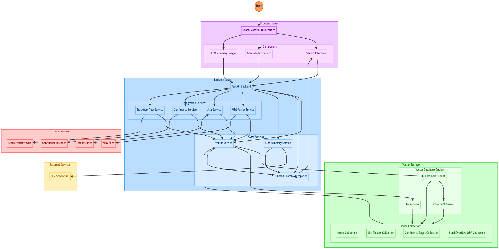

# Support Buddy

A GenAI-powered solution for handling support issues / queries by analyzing Microsoft Outlook MSG files, Jira tickets, Confluence pages, and StackOverflow Q&A to identify root causes and solutions.

## Architecture


## Project Structure

```
SupportBuddy/
├── backend/
│   ├── app/
│   │   ├── __init__.py
│   │   ├── main.py
│   │   ├── api/
│   │   ├── core/
│   │   ├── logs/
│   │   ├── models/
│   │   └── services/
│   ├── data/
│   ├── tests/
│   ├── Dockerfile
│   ├── LearnChromaDB.py
│   ├── check_chromadb.py
│   ├── pyproject.toml
│   ├── pytest.ini
│   └── uv.lock
├── confluence-config/
│   ├── dbconfig.xml
│   └── server.xml
├── frontend/
│   ├── package.json
│   ├── public/
│   └── src/
├── jira-config/
│   ├── dbconfig.xml
│   └── server.xml
├── chroma-config.yaml
├── deduplication_plan.md
├── docker-compose.yml
├── LICENSE
├── README.md
├── set_venv.sh
├── start_backend.sh
├── start_chromadb_server.ps1
├── start_chromadb_server.sh
└── start_frontend.sh
```

## LLM Integration (OpenRouter)

Support Buddy supports LLM-powered summarization of search results using OpenRouter. This feature provides concise summaries and action points for your search queries, powered by models like GPT-3.5/4 and others via OpenRouter.

### Enabling LLM Summaries

1. **Obtain an OpenRouter API Key:**
   - Sign up and get your API key from https://openrouter.ai/

2. **Configure Environment Variables:**
   Add the following to your `backend/.env` (see `.env.example`):
   ```env
   # OpenRouter LLM API settings
   OPENROUTER_API_KEY=your-openrouter-api-key
   OPENROUTER_API_URL=https://openrouter.ai/api/v1/chat/completions
   OPENROUTER_MODEL=openai/gpt-3.5-turbo  # Or any available model
   YOUR_SITE_URL=http://localhost:3000    # For analytics (optional)
   YOUR_APP_NAME=SupportBuddy            # For analytics (optional)
   ```

3. **Frontend Usage:**
   - On the Search page, enable the "LLM" checkbox before searching to get an LLM-generated summary of the results.
   - The summary will appear at the top of the results, styled for both dark and light mode.

4. **Backend:**
   - The backend will use the configured OpenRouter API key and model to generate summaries when requested.
   - You can change the default model by updating `OPENROUTER_MODEL` in your `.env`.

### Security Note
- **Never commit your real API key to version control.** Use `.env` for secrets and `.env.example` for templates only.

## Index Data (ChromaDB / FAISS)

Support Buddy can use either ChromaDB or FAISS as its vector database backend. All references to "ChromaDB/FAISS collections" in the UI have been updated to "Index Data" or "Index collections" to reflect this flexibility.

*   **ChromaDB (Default):** Uses a persistent ChromaDB instance. The data is stored in the directory specified by the `VECTOR_DB_PATH` environment variable (defaults to `./data/chroma`). You can also run ChromaDB as a separate server and connect via HTTP by setting `CHROMA_USE_HTTP=true`.
*   **FAISS (Alternative):** Uses a local FAISS index for vector storage. To enable FAISS, set the environment variable `USE_FAISS=true`. The FAISS index files will be stored in the directory specified by the `FAISS_INDEX_PATH` environment variable (defaults to `./data/faiss`).

**Switching:**

To switch between backends, modify the relevant environment variables (e.g., in your `.env` file or export them) before starting the backend application.

Example `.env` for FAISS:

```dotenv
USE_FAISS=true
# FAISS_INDEX_PATH=./data/my_faiss_index # Optional: Override default path
```

Example `.env` for ChromaDB (Persistent Client):

```dotenv
# USE_FAISS=false # Or simply omit USE_FAISS
VECTOR_DB_PATH=./data/my_chroma_db # Optional: Override default path
```

Example `.env` for ChromaDB (HTTP Client):

```dotenv
# USE_FAISS=false
CHROMA_USE_HTTP=true
# CHROMA_HTTP_HOST=your_chroma_server # Optional: Specify host if not localhost
# CHROMA_HTTP_PORT=8000 # Optional: Specify port if not 8000
```

**Note:** Ensure the required dependencies are installed. `faiss-cpu` is needed for FAISS support (included in `pyproject.toml`).

## Admin UI: View and Clear Index Data

- The Admin page (formerly "Admin Chroma") is now labeled "View Index Data" and displays all collections and their records for the currently active backend (ChromaDB or FAISS).
- The Clear page/button now reads "Clear Index Data".
- The UI and backend work seamlessly with either backend. All collections and records are shown in a consistent format.

## Backend API: `/chroma-collections`

- This endpoint returns all index collections and their records (id, document, metadata).
- For ChromaDB: returns real records from the collection.
- For FAISS: returns real records from the collection (auto-loads from disk if needed).
- The backend logic for fetching all FAISS collections and their records is encapsulated in `FaissClient.get_collections_with_records()` for maintainability.

## Example API Response

```json
{
  "collections": [
    {
      "collection_name": "issues",
      "records": [
        { "id": "abc123", "document": "...", "metadata": { ... } },
        ...
      ]
    },
    ...
  ]
}
```

## .env Summary

- `USE_FAISS=true` to use FAISS as the backend index store.
- `USE_FAISS=false` or unset to use ChromaDB.
- `FAISS_INDEX_PATH` and `VECTOR_DB_PATH` control storage locations.
- All UI and backend features work with either backend.

## Refactoring & Maintenance

- The logic for returning all FAISS collections and their records is now in `FaissClient.get_collections_with_records()`.
- The backend and frontend are robust to either backend and display actual record data.
- All references to "ChromaDB collections" in the UI and docs are now "Index Data" for clarity.

## Overview

This application helps teams manage support issues / queries by:

1. Reading and parsing Microsoft Outlook MSG files containing issue details
2. Integrating with Jira to correlate tickets with issue reports
3. Ingesting and searching knowledge from Confluence pages and StackOverflow Q&A
4. Storing the extracted information in a vector database for semantic search
5. Providing a simple UI to query historical issues and find relevant solutions, and to configure search parameters

## Features

- MSG file parsing with metadata and attachment extraction
- Jira integration with bi-directional linking
- Confluence integration: ingest and search Confluence pages (supports Basic Auth with username/password for Server/DC)
- StackOverflow integration: ingest, index, and search StackOverflow Q&A
- Unified search results: All sources (Issues, Confluence, Stack Overflow) are combined and sorted by similarity percentage in a single backend response for the frontend to display
- Automatic deduplication for all sources using content-based hashing
- Semantic search with sentence transformers
- Bulk ingestion of MSG files, Confluence pages, and StackOverflow Q&A
- Vector search with configurable similarity threshold
- Responsive, feature-rich Material UI interface and configuration management
- **ChromaDB Admin UI support:** (If using Chroma's admin UI, see Chroma documentation)
- **Jira ID search boost:** Searching for a Jira ID will always return the exact match as the top result (similarity score 1.0)

## System Architecture

### Core Components

1. **Backend Services** (FastAPI)
   - MSG Parser: Extracts data from Outlook MSG files
   - Jira Service: Handles Jira ticket integration
   - Confluence Service: Manages Confluence page ingestion and search
   - StackOverflow Service: Handles ingestion, indexing, and semantic search of StackOverflow Q&A
   - Vector Service: Manages ChromaDB operations, semantic search, and deduplication
   - Unified Search Aggregation: Combines and sorts all results by similarity percentage before returning to the frontend. Legacy result arrays are deprecated for UI use.

2. **Vector Database** (ChromaDB)
   - Stores embeddings for semantic search
   - Content-based deduplication using SHA256 hashes
   - Collections for support issues, Jira tickets, Confluence pages, StackOverflow Q&A
   - Configurable similarity threshold
   - Admin UI for monitoring

3. **Knowledge Integration**
   - Bi-directional Jira ticket linking
   - Confluence page ingestion and search
   - StackOverflow Q&A ingestion, indexing, and search
   - Unified search across all sources

4. **Frontend** (React/Material-UI)
   - Search interface with configurable parameters
   - Issue management and ingestion tools
   - Real-time search results with similarity scores
   - Unified results rendering: All search views use the unified, similarity-sorted results array

## Setup Instructions

### Prerequisites
- Python 3.11+
- uv (https://github.com/astral-sh/uv) for Python dependency management
  - Install with `pip install uv` or `brew install uv`
- Node.js and npm
- Docker and Docker Compose (for containerized setup)
- Jira instance (local or cloud)
- Confluence instance (local, via Docker Compose)
- Internet access for StackOverflow Q&A ingestion
- PostgreSQL (or use containerized version)

### Development Setup
1. Clone this repository
2. Install backend dependencies (Python 3.11 recommended):
   ```bash
   ./start_backend.sh
   ```
   - This script will create a `.venv` using `uv`, and install dependencies from `pyproject.toml` via `uv sync`.
   - You do NOT need to manage `requirements.txt` anymore. All dependencies are managed in `pyproject.toml`.
   - To add or update dependencies, edit `pyproject.toml` and run `uv sync`.
3. Configure environment variables (see Environment Variables section)
   - For **Confluence Server**, set these in `backend/.env`:
     ```env
     CONFLUENCE_USERNAME=your-confluence-username
     CONFLUENCE_PASSWORD=your-confluence-password
     ```
   - For **Jira**, use:
     ```env
     JIRA_USERNAME=your-jira-username
     JIRA_PASSWORD=your-jira-password
     # Or, for Jira Cloud:
     # JIRA_API_TOKEN=your-jira-api-token
     ```
4. Start the services:
   - Development mode:
     ```bash
     ./start_backend.sh  # Starts backend with auto-reload
     ./start_frontend.sh  # Starts frontend dev server
     ```
   - Production mode:
     ```bash
     ./start_backend.sh --no-reload --host 0.0.0.0
     ./start_frontend.sh
     ```

## Vector Database Configuration

Support Buddy can use either ChromaDB or FAISS as its vector database backend.

*   **ChromaDB (Default):** Uses a persistent ChromaDB instance. The data is stored in the directory specified by the `VECTOR_DB_PATH` environment variable (defaults to `./data/chroma`). You can also run ChromaDB as a separate server and connect via HTTP by setting `CHROMA_USE_HTTP=true`.
*   **FAISS (Alternative):** Uses a local FAISS index for vector storage. To enable FAISS, set the environment variable `USE_FAISS=true`. The FAISS index files will be stored in the directory specified by the `FAISS_INDEX_PATH` environment variable (defaults to `./data/faiss`).

**Switching:**

To switch between databases, modify the relevant environment variables (e.g., in your `.env` file or export them) before starting the backend application.

Example `.env` for FAISS:

```dotenv
USE_FAISS=true
# FAISS_INDEX_PATH=./data/my_faiss_index # Optional: Override default path
```

Example `.env` for ChromaDB (Persistent Client):

```dotenv
# USE_FAISS=false # Or simply omit USE_FAISS
VECTOR_DB_PATH=./data/my_chroma_db # Optional: Override default path
```

Example `.env` for ChromaDB (HTTP Client):

```dotenv
# USE_FAISS=false
CHROMA_USE_HTTP=true
# CHROMA_HTTP_HOST=your_chroma_server # Optional: Specify host if not localhost
# CHROMA_HTTP_PORT=8000 # Optional: Specify port if not 8000
```

**Note:** Ensure the required dependencies are installed. `faiss-cpu` is needed for FAISS support (included in `pyproject.toml`).

### Docker Usage
- The backend Dockerfile now uses `uv sync` and `pyproject.toml` for dependency management. No need for `requirements.txt`.
- Example build and run:
  ```bash
  docker build -t support-buddy-backend ./backend
  docker run --env-file ./backend/.env -p 8000:8000 support-buddy-backend
  ```

### Notes
- The `.venv/` directory is now the standard location for the Python virtual environment (see `.gitignore`).
- All Python dependencies are managed in `pyproject.toml` and installed with `uv sync` (see [start_backend.sh](./start_backend.sh) and [backend/Dockerfile](./backend/Dockerfile)).

## Starting the Frontend

To start the frontend React application, use the provided script:
```sh
./start_frontend.sh
```

## Activating the Backend Python Virtual Environment

To activate the backend's Python virtual environment, use the provided script:
```sh
source ./set_venv.sh
```

## Environment Variables
The backend requires a `.env` file with configuration for:
```env
# Jira Settings
JIRA_URL=http://localhost:9090
JIRA_USERNAME=admin
JIRA_PASSWORD=admin      # For local/server instance
JIRA_API_TOKEN=          # For cloud instance
# Confluence Settings
CONFLUENCE_USERNAME=your-confluence-username
CONFLUENCE_PASSWORD=your-confluence-password
# Vector DB Settings
VECTOR_DB_PATH=./data/chroma
EMBEDDING_MODEL=sentence-transformers/all-MiniLM-L6-v2
# (No special StackOverflow credentials required for public Q&A ingestion)
```

## Backend Search Logic
- When searching for a Jira ID (e.g., `PROJ-123`), the backend will always boost the exact match to the top of the results (similarity score 1.0), regardless of embedding similarity.
- Jira ticket IDs are always included in the embedded text for accurate matching.

## Unified Search Result API
- `/search` endpoint returns a single `results` array, sorted by similarity percentage, with a `type` field for each result (`vector_issue`, `confluence`, `stackoverflow`)

### Example Response
```json
{
  "results": [
    { "type": "vector_issue", "id": "...", "similarity_score": 0.91, ... },
    { "type": "confluence", "page_id": "...", "similarity_score": 0.87, ... },
    { "type": "stackoverflow", "id": "...", "similarity_score": 0.85, ... }
  ],
  "vector_issues": [...],
  "confluence_results": [...],
  "stackoverflow_results": [...]
}
```

## Logging

Backend logs are written to `backend/app/logs/backend.log`. You can also view logs in the console.

## Running Tests

### Backend
From the `backend/` directory:
```bash
pytest --maxfail=1 --disable-warnings -v
```

### Frontend
From the `frontend/` directory:
```bash
npm test
```

## Monitoring & Logging
- Logs stored in `backend/logs/`
- Configure log levels in `backend/app/core/logging_config.py`
- Component-specific logging for MSG parsing, Jira, Confluence, StackOverflow, deduplication, vector ops, and search
- Health checks: backend API `/health`, DB connections, vector DB collections, Jira/Confluence connectivity, StackOverflow ingestion

## Performance Tuning
- Similarity threshold (default 0.2) in `backend/app/core/similarity_config.json`
- Resource management: cleanup, archiving, disk space monitoring
- Query performance: result limits, response times, batch sizes

## Security Considerations
- API security: CORS, rate limiting, input validation, secure file handling
- Integration security: Jira/Confluence credentials, API token rotation
- Data protection: secure file handling, DB encryption, network isolation, access controls

## System Operations
### Deployment
- Development: `start_backend.sh`, `start_frontend.sh`
- Production: Docker Compose, persistent data volumes
- Backend startup script ensures all services are ready before launch

### Monitoring
- Service health: API endpoints, DB checks, vector DB status, Jira/Confluence connectivity
- Performance metrics: query times, embedding speed, storage, cache

### Testing & Quality
- Automated tests: backend (pytest), frontend (React), integration, vector search validation
- Performance testing: load, batch, response times, memory

### Configuration Management
- `.env` for service settings
- Docker Compose for orchestration
- Jira/Confluence/StackOverflow setup
- Vector DB and file storage configuration

### Security
- Authentication: Jira/Confluence credentials, StackOverflow public Q&A does not require authentication
- Data protection: file handling, encryption, network, access controls

## ChromaDB Setup (Docker Compose)

ChromaDB is now run as a Docker container using Docker Compose. The `docker-compose.yml` file includes a `chroma` service with a healthcheck that ensures the service is healthy only if it returns HTTP 200 on its heartbeat endpoint.

**To start all services (including ChromaDB):**
```bash
docker compose up -d
```

- The ChromaDB Admin UI is available at [http://localhost:3500](http://localhost:3500) if you wish to monitor collections.
- The backend connects to ChromaDB via HTTP (see below).

## Backend ChromaDB HTTP Client Configuration

The backend is configured to connect to ChromaDB using the HTTP API (`chroma_use_http=True`).

- Ensure your `pyproject.toml` specifies a `chromadb` version that matches the Docker image (e.g., `chromadb==1.0.5` if using `chromadb/chroma:1.0.5`).
- The backend will use `chromadb.HttpClient` when `chroma_use_http` is enabled. Do not pass local-only settings (like `persist_directory`) to the HTTP client.
- Example environment variable (in `backend/.env`):
  ```env
  CHROMA_USE_HTTP=true
  CHROMA_SERVER_HOST=chroma
  CHROMA_SERVER_HTTP_PORT=8000
  ```

- The backend will connect to ChromaDB at `http://chroma:8000` when running in Docker Compose.

## Healthcheck for ChromaDB

The `docker-compose.yml` healthcheck for ChromaDB is:
```yaml
test: ["CMD", "bash", "-c", "curl -fsS -o /dev/null -w '%{http_code}' http://localhost:8000/api/v2/heartbeat | grep 200"]
interval: 30s
timeout: 10s
retries: 3
```

This ensures the service is only marked healthy if it returns HTTP 200.

## Troubleshooting: ChromaDB HTTP Mode

If you see an error like:
```
{"error":"KeyError('_type')"}
```

when using `chroma_use_http=True`, this usually means:
- The client and server versions of ChromaDB are mismatched.
- You are using a feature or API call not supported in HTTP mode.

**How to fix:**
1. Ensure the `chromadb` Python package version in your backend matches the Docker image version.
2. Ensure you are using `chromadb.HttpClient` and not `PersistentClient`.
3. Avoid passing local-only settings (like `persist_directory`) to the HTTP client.

**To update your backend's ChromaDB version:**
```bash
uv pip install --upgrade chromadb==1.0.5
```

**If you change the Docker image version, update your backend's `chromadb` version to match.**

## Summary
Support Buddy provides a comprehensive solution for support issue management through:
1. **Knowledge Integration**: MSG file parsing, Jira synchronization, Confluence integration, StackOverflow Q&A ingestion, automatic deduplication
2. **Intelligent Search**: Vector-based semantic search, configurable similarity, cross-source aggregation, real-time ranking
3. **Modern Architecture**: Containerized microservices, vector database, React UI, extensible API design

## Troubleshoot

If you encounter issues during setup or operation, consider the following troubleshooting steps:

1. **Jira Database Password Issue:**
   - Ensure that the `ATL_SECURED` password in your Jira `dbconfig.xml` matches the password you configured during the Jira database setup.

2. **Confluence Postgres Port Issue:**
   - If Confluence is not starting with the default `5433` port for its `confluence-postgres` service:
     1. Edit the configuration to use port `5432` instead of `5433`.
     2. Run the following command to start Confluence for initial setup:
        ```bash
        docker compose up -d confluence
        ```
     3. Complete the initial setup steps in Confluence.
     4. Revert the port back to `5433` in your configuration if needed.
     5. Start the backend as usual with:
        ```bash
        ./start_backend.sh
        ```

3. **ChromaDB KeyError Issue:**
   - If you encounter a `KeyError('_type')` when using ChromaDB in HTTP mode:
     1. Verify that the backend's `chromadb` Python package version matches the Docker image version.
     2. Ensure you are using `chromadb.HttpClient` and not `PersistentClient`.
     3. Avoid passing local-only settings (like `persist_directory`) to the HTTP client.
