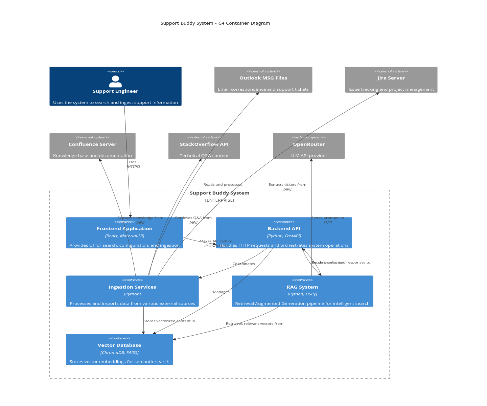
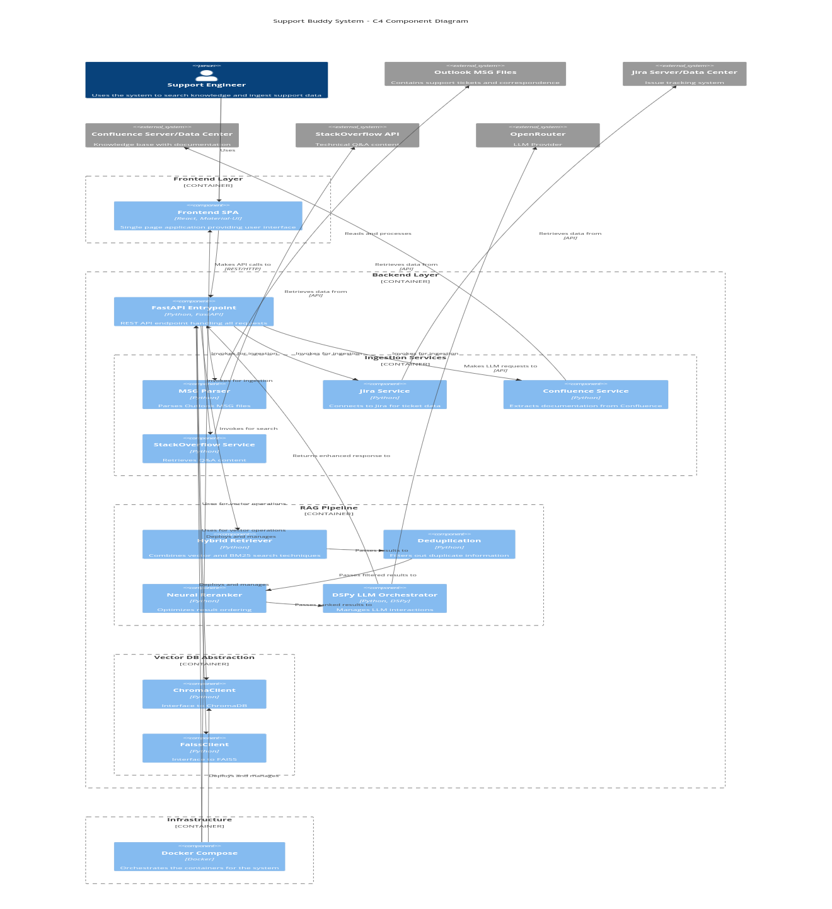
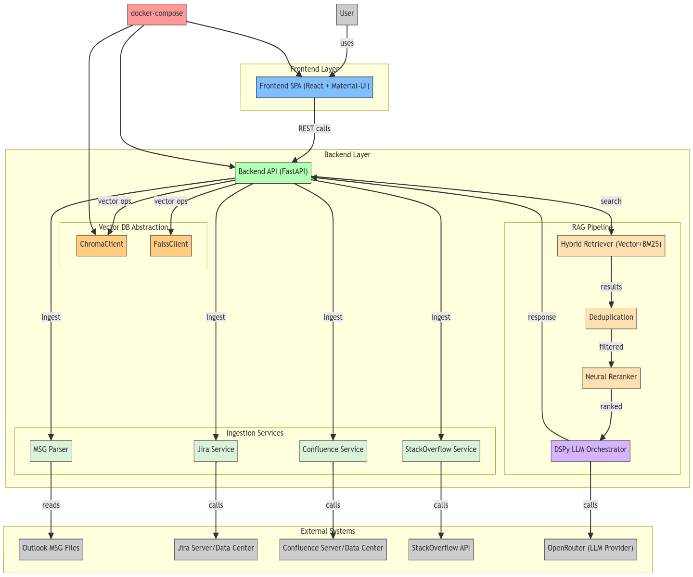

# Support Buddy

A GenAI-powered RAG solution for handling support issues / queries by analyzing Microsoft Outlook MSG files, Jira tickets, Confluence pages, and StackOverflow Q&A to identify root causes and solutions.

## Architecture

### C4 - Container Diagram



### C4 - Component Diagram




### End to End Flow


## Project Structure

```
SupportBuddy/
├── backend/
│   ├── app/
│   │   ├── __init__.py
│   │   ├── main.py
│   │   ├── api/
│   │   ├── core/
│   │   ├── logs/
│   │   ├── models/
│   │   └── services/
│   ├── data/
│   ├── tests/
│   ├── Dockerfile
│   ├── LearnChromaDB.py
│   ├── check_chromadb.py
│   ├── pyproject.toml
│   ├── pytest.ini
│   └── uv.lock
├── confluence-config/
│   ├── dbconfig.xml
│   └── server.xml
├── frontend/
│   ├── package.json
│   ├── public/
│   └── src/
├── jira-config/
│   ├── dbconfig.xml
│   └── server.xml
├── chroma-config.yaml
├── deduplication_plan.md
├── docker-compose.yml
├── LICENSE
├── README.md
├── set_venv.sh
├── start_backend.sh
├── start_chromadb_server.ps1
├── start_chromadb_server.sh
└── start_frontend.sh
```


## Overview

This application helps teams manage support issues / queries by:

1. Reading and parsing Microsoft Outlook MSG files containing issue details
2. Integrating with Jira to correlate tickets with issue reports
3. Ingesting and searching knowledge from Confluence pages and StackOverflow Q&A
4. Storing the extracted information in a vector database for semantic search
5. Providing a simple UI to query historical issues and find relevant solutions, and to configure search parameters
6. Dual vector database support: Use either ChromaDB (local/server) or FAISS for semantic search and storage. Switchable via `USE_FAISS` environment variable.
7. **LLM integration:** Summarize and recommend actions using DSPy-powered LLMs (e.g., OpenRouter), configurable via environment and runtime API.
8. Modular, pluggable backend: Easily extend to new data sources, vector DBs, or LLM providers.

## Features

- **RAG Pipeline:** Implements a hybrid retrieval-augmented generation pipeline with:
  - Vector + BM25 hybrid retrieval
  - Fusion with deduplication
  - Neural reranking (CrossEncoder)
  - LLM generation
- **MSG File Parsing:** Extracts metadata, attachments, and content from Microsoft Outlook MSG files for downstream analysis.
- **Jira Integration:** Bi-directional synchronization and linking with Jira tickets, enabling seamless correlation between email issues and ticketing workflows.
- **Confluence Integration:** Ingests and semantically searches Confluence pages, supporting Basic Auth for Server/Data Center deployments.
- **StackOverflow Integration:** Ingests, indexes, and enables semantic search across StackOverflow Q&A for relevant solutions.
- **Unified Semantic Search:** Aggregates and ranks results from all sources (MSG, Jira, Confluence, StackOverflow) in a single, similarity-sorted response for the frontend.
- **Automatic Deduplication:** Detects and removes duplicate issues across all data sources using robust content-based hashing.
- **Advanced Semantic Search:** Utilizes sentence transformer models and DSPy-powered LLM reranking for deep semantic retrieval and similarity matching.
- **Bulk Ingestion:** Supports bulk import of MSG files, Confluence pages, and StackOverflow Q&A for rapid knowledge base expansion.
- **Configurable Vector Search:** Allows tuning of similarity thresholds to control search precision and recall.
- **Pluggable Vector Database:** Supports both ChromaDB (local/server) and FAISS (local, high-performance) as interchangeable backends, selectable via the `USE_FAISS` environment variable.
- **LLM-Powered Summarization:** Integrates with DSPy LLMs (e.g., OpenRouter) to generate summaries and recommended actions from top search results, with runtime toggling per query.
- **Modern, Responsive UI:** Provides a feature-rich, Material UI-based frontend for search, configuration, and management.
- **ChromaDB Admin UI:** Includes support for ChromaDB’s Admin UI for monitoring and managing vector collections.
- **Jira ID Search Boost:** Guarantees exact Jira ticket ID matches are always ranked as the top result (similarity score 1.0), regardless of embedding similarity.

## System Architecture

### Core Components

1. **Backend Services** (Python, FastAPI)
   - **MSG Parser:** Extracts metadata, attachments, and content from Outlook MSG files for ingestion and analysis.
   - **Jira Service:** Integrates with Jira for ticket synchronization, linking, and enrichment of support issues.
   - **Confluence Service:** Handles ingestion and semantic search of Confluence pages, supporting enterprise authentication.
   - **StackOverflow Service:** Ingests and indexes StackOverflow Q&A, enabling semantic retrieval of community knowledge.
   - **Vector Service:** Abstracts vector database operations (add/search/delete), semantic search, and deduplication logic.
   - **Unified Search Aggregation:** Combines, deduplicates, and sorts results from all sources, returning a single, similarity-ranked array for the frontend.
   - **DSPy-Orchestrated RAG Pipelines:** All major services now use DSPy for LLM orchestration and reranking.

2. **Vector Database Layer**
   - **ChromaDB:** Persistent or server mode vector database for storing and searching embeddings, with content-based deduplication and per-source collections.
   - **FAISS:** High-performance, local vector search engine, mimicking ChromaDB’s API for seamless interchangeability.
   - **Runtime Switching:** Easily switch between ChromaDB and FAISS via environment configuration (`USE_FAISS`), with all vector operations routed through a unified abstraction.
   - **Admin UI:** ChromaDB Admin UI support for monitoring and managing vector collections.
   - **Configurable Similarity:** Supports tuning of similarity thresholds and collection management.

3. **Knowledge Integration**
   - **Bi-directional Jira Linking:** Maintains links between MSG issues and Jira tickets for traceability.
   - **Confluence Integration:** Ingests and enables search over enterprise documentation.
   - **StackOverflow Integration:** Brings in external community solutions for broader support coverage.
   - **Unified Knowledge Base:** Enables cross-source, deduplicated, and semantically ranked search across all integrated systems.

4. **Frontend** (React, Material-UI)
   - **Search Interface:** Modern, responsive UI for querying, filtering, and exploring search results.
   - **Issue Management:** Tools for bulk ingestion, manual entry, and curation of support issues.
   - **Real-Time Results:** Displays similarity-ranked, unified results with LLM summaries and metadata.
   - **Configuration Management:** UI for adjusting search parameters, managing sources, and toggling features.

5. **LLM Integration**
   - **Summarization & Recommendations:** Uses DSPy-powered LLMs (e.g., OpenRouter) to generate concise summaries and action points from top search results.
   - **Configurable:** Number of results sent to LLM and model selection are runtime-configurable.
   - **Frontend Toggle:** Users can enable or disable LLM-powered summaries per search.

## LLM Integration (DSPy & OpenRouter)

Support Buddy supports LLM-powered summarization and reranking of search results using DSPy. This feature provides concise summaries and action points for your search queries, powered by models like OpenRouter (e.g., GPT-3.5/4) and others via DSPy.

### Enabling LLM Summaries

1. **Obtain an OpenRouter API Key:**
   - Sign up and get your API key from https://openrouter.ai/

2. **Configure Environment Variables:**
   Add the following to your `backend/.env` (see `.env.example`):
   ```env
   # OpenRouter LLM API settings
   OPENROUTER_API_KEY=your-openrouter-api-key
   OPENROUTER_API_URL=https://openrouter.ai/api/v1/chat/completions
   OPENROUTER_MODEL=openai/gpt-3.5-turbo  # Or any available model
   YOUR_SITE_URL=http://localhost:3000    # For analytics (optional)
   YOUR_APP_NAME=SupportBuddy            # For analytics (optional)
   ```

### **Frontend Usage:**
   - On the Search page, enable the "LLM" checkbox before searching to get an LLM-generated summary of the results.
   - The summary will appear at the top of the results, styled for both dark and light mode.

### **Backend:**
   - The backend uses DSPy to orchestrate LLM calls and reranking. All LLM and reranker calls are handled via DSPy modules (see service code for details).
   - You can change the default model by updating the argument to `dspy.LM()` in the relevant service, or update `OPENROUTER_MODEL` in your `.env` for legacy wrappers.

### Security Note
- **Never commit your real API key to version control.** Use `.env` for secrets and `.env.example` for templates only.

## DSPy Integration Changes (April 2025)

### What Was Updated
- **RAG Pipelines** for Stack Overflow, Jira, and MSG parser services now use DSPy for LLM orchestration and reranking.
- **Reranker**: All `_get_rag_pipeline()` functions now instantiate the reranker using `get_reranker()` (a CrossEncoder model) instead of passing `None`.
- **LLM Provider**: All RAG pipelines now instantiate the LLM using `dspy.LM` (via DSPy) instead of custom or legacy LLM service wrappers.

### How to Use
- LLM calls and reranking are now handled via the DSPy library. To change models, update the argument to `dspy.LM` in the relevant service.
- All LLM and reranker calls are abstracted through DSPy modules; you do not need to call OpenRouter APIs directly.
- For custom LLM logic, see the new `_get_rag_pipeline()` implementations in `app/services/stackoverflow_service.py`, `jira_service.py`, and `msg_parser.py`.

### Why This Matters
- Unified, robust, and maintainable RAG pipeline logic for all major data sources.
- Eliminates direct OpenRouter API handling and error-prone custom wrappers.
- Easy to upgrade or swap LLMs and rerankers using DSPy’s modular approach.

---

**For more details, see the code in `backend/app/services/stackoverflow_service.py`, `jira_service.py`, and `msg_parser.py`.**

## Index Data: ChromaDB & FAISS Support

Support Buddy provides flexible vector database support, allowing you to choose between ChromaDB (default) and FAISS (alternative) as the backend for semantic search and storage. All references to "ChromaDB/FAISS collections" in the UI and documentation are now referred to as "Index Data" or "Index Collections" for clarity.

**Backend Options:**
- **ChromaDB (Default):**
  - Persistent, local vector database. Data is stored at the path specified by `VECTOR_DB_PATH` (default: `./data/chroma`).
  - Optionally, run ChromaDB as a server and connect via HTTP by setting `CHROMA_USE_HTTP=true`.
- **FAISS (Alternative):**
  - Local, high-performance vector index. Enable by setting `USE_FAISS=true`.
  - Index files are stored at `FAISS_INDEX_PATH` (default: `./data/faiss`).

**Switching Backends:**
- Select the backend by setting the appropriate environment variables in your `.env` file before starting the backend:

  **Example `.env` for FAISS:**
  ```dotenv
  USE_FAISS=true
  # FAISS_INDEX_PATH=./data/my_faiss_index # (optional)
  ```

  **Example `.env` for ChromaDB (Persistent Client):**
  ```dotenv
  # USE_FAISS=false # Or simply omit USE_FAISS
  VECTOR_DB_PATH=./data/my_chroma_db # (optional)
  ```

  **Example `.env` for ChromaDB (HTTP Client):**
  ```dotenv
  # USE_FAISS=false
  CHROMA_USE_HTTP=true
  # CHROMA_HTTP_HOST=your_chroma_server # (optional)
  # CHROMA_HTTP_PORT=8000 # (optional)
  ```

- Ensure all required dependencies are installed (`faiss-cpu` for FAISS, included in `pyproject.toml`).

## Admin UI: Viewing & Managing Index Data

- The Admin page View Index Data displays all collections and their records for the active backend (ChromaDB or FAISS).
- The Clear Index Data action deletes all collections and their records for the active backend.
- The UI and backend seamlessly support both backends, presenting collections and records in a unified format for consistency.

## Backend API: `/chroma-collections`

- Returns all index collections and their records (`id`, `document`, `metadata`).
- **ChromaDB:** Returns real records directly from the collection.
- **FAISS:** Returns real records from the collection, auto-loading from disk as needed.
- Backend logic for FAISS is encapsulated in `FaissClient.get_collections_with_records()` for maintainability.

## Example API Response

```json
{
  "collections": [
    {
      "collection_name": "issues",
      "records": [
        { "id": "abc123", "document": "...", "metadata": { ... } },
        ...
      ]
    },
    ...
  ]
}
```

## Environment Variable Summary

- `USE_FAISS=true` to use FAISS as the backend index store.
- `USE_FAISS=false` or unset to use ChromaDB.
- `FAISS_INDEX_PATH` and `VECTOR_DB_PATH` control storage locations for FAISS and ChromaDB, respectively.
- All UI and backend features are compatible with either backend.

## Refactoring & Maintenance Notes

- Logic for retrieving all FAISS collections and their records is encapsulated in `FaissClient.get_collections_with_records()`.
- Both backend and frontend are robust to either backend and display actual record data.
- All references to "ChromaDB collections" in the UI and docs have been updated to "Index Data" for clarity and consistency.

## Setup Instructions

For detailed setup and configuration instructions, please see [SETUP.md](SETUP.md).


## Troubleshooting

For detailed troubleshooting information, please see [TROUBLESHOOT.md](TROUBLESHOOT.md).

## Summary
Support Buddy provides a comprehensive solution for support issue management through:
1. **Knowledge Integration**: MSG file parsing, Jira synchronization, Confluence integration, StackOverflow Q&A ingestion, automatic deduplication
2. **Intelligent Search**: Vector-based semantic search, configurable similarity, cross-source aggregation, real-time ranking
3. **Modern Architecture**: Containerized microservices, vector database, React UI, extensible API design

