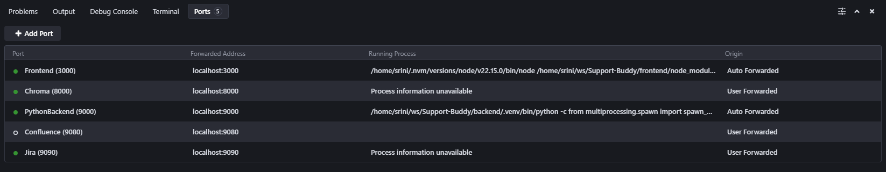

# Troubleshooting Guide

## Common Issues and Solutions

### Monitoring & Logging
- Logs stored in `backend/logs/`
- Configure log levels in `backend/app/core/logging_config.py`
- Component-specific logging for MSG parsing, Jira, Confluence, StackOverflow, deduplication, vector ops, and search
- Health checks: backend API `/health`, DB connections, vector DB collections, Jira/Confluence connectivity, StackOverflow ingestion

### Performance Tuning
- Similarity threshold (default 0.2) in `backend/app/core/config.json`
- Resource management: cleanup, archiving, disk space monitoring
- Query performance: result limits, response times, batch sizes

### Security Considerations
- API security: CORS, rate limiting, input validation, secure file handling
- Integration security: Jira/Confluence credentials, API token rotation
- Data protection: secure file handling, DB encryption, network isolation, access controls

### System Operations
#### Deployment
- Development: `start_backend.sh`, `start_frontend.sh`
- Production: Docker Compose, persistent data volumes
- Backend startup script ensures all services are ready before launch

#### Monitoring
- Service health: API endpoints, DB checks, vector DB status, Jira/Confluence connectivity
- Performance metrics: query times, embedding speed, storage, cache

#### Testing & Quality
- Automated tests: backend (pytest), frontend (React), integration, vector search validation
- Performance testing: load, batch, response times, memory

#### Configuration Management
- `.env` for service settings
- Docker Compose for orchestration
- Jira/Confluence/StackOverflow setup
- Vector DB and file storage configuration

#### Security
- Authentication: Jira/Confluence credentials, StackOverflow public Q&A does not require authentication
- Data protection: file handling, encryption, network, access controls

## Other Setup Troubleshoot

If you encounter issues during setup or operation, consider the following troubleshooting steps:

1. **Jira Database Password Issue:**
   - Ensure that the `ATL_SECURED` password in your Jira `dbconfig.xml` matches the password you configured during the Jira database setup.

2. **Confluence Postgres Port Issue:**
   - If Confluence is not starting with the default `5433` port for its `confluence-postgres` service:
     1. Edit the configuration to use port `5432` instead of `5433`.
     2. Run the following command to start Confluence for initial setup:
        ```bash
        docker compose up -d confluence
        ```
     3. Complete the initial setup steps in Confluence.
     4. Revert the port back to `5433` in your configuration if needed.
     5. Start the backend as usual with:
        ```bash
        ./start_backend.sh
        ```

3. **ChromaDB KeyError Issue:**
   - If you encounter a `KeyError('_type')` when using ChromaDB in HTTP mode:
     1. Verify that the backend's `chromadb` Python package version matches the Docker image version.
     2. Ensure you are using `chromadb.HttpClient` and not `PersistentClient`.
     3. Avoid passing local-only settings (like `persist_directory`) to the HTTP client.

4. **WSL PowerShell ENOENT Error:**
   - If you encounter a `ENOENT: no such file or directory, open '/mnt/c/Windows/System32/WindowsPowerShell/v1.0/powershell.exe'` error when running commands in WSL:
     - This usually means the expected PowerShell executable path does not exist in your WSL environment.
     - To resolve this, create the necessary directories and a symlink to the actual PowerShell executable:
       1. Create the directory structure:
          ```bash
          sudo mkdir -p /mnt/c/Windows/System32/WindowsPowerShell/v1.0/
          ```
       2. Create a symlink to the PowerShell executable (adjust the source path if your PowerShell is elsewhere):
          ```bash
          sudo ln -s /usr/bin/pwsh /mnt/c/Windows/System32/WindowsPowerShell/v1.0/powershell.exe
          ```
      - This should resolve the ENOENT error when tools expect PowerShell at the default Windows path.

   4.1. Enable Port Forward in vscode Ports View for WSL2
   
      
