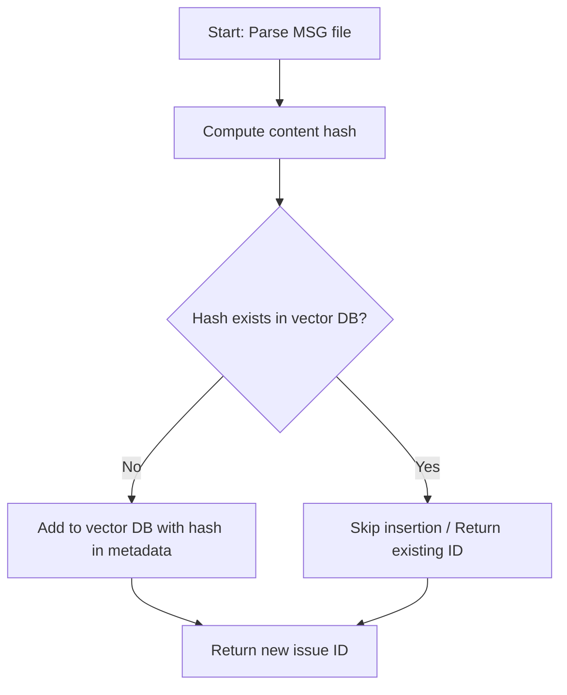
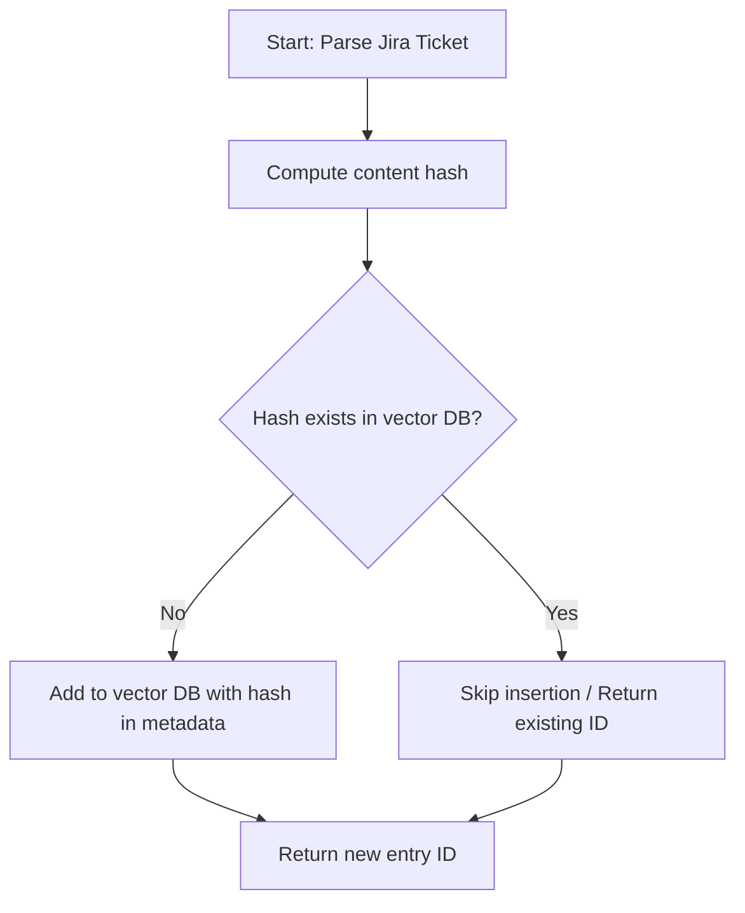
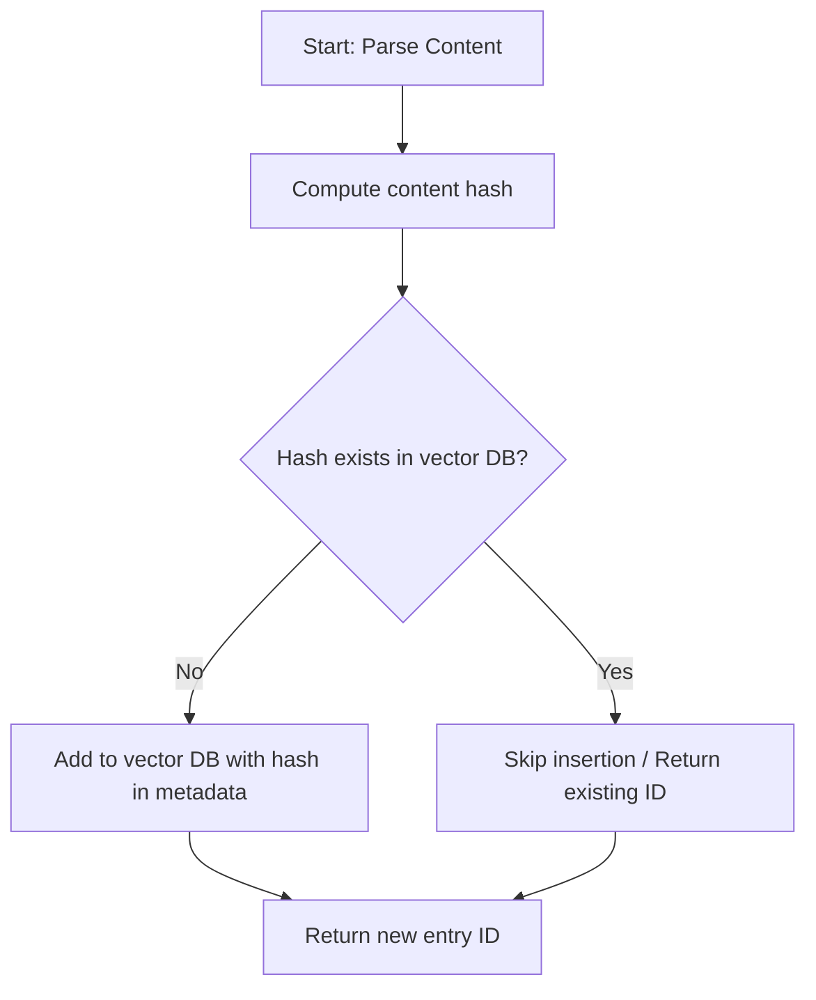

# Deduplication Plan for Vector Database Message Ingestion

## Objective

Prevent duplicate message file content from being stored in the vector database.  
A duplicate is defined as any entry where both the subject and body fields are identical.

---

## Deduplication Logic

1. **Hashing for Uniqueness**
   - Compute a SHA256 hash of the concatenated subject and body fields for each message.
   - Store this hash in the metadata for each entry in the vector database.

2. **Pre-insertion Check**
   - Before inserting a new message, query the vector database for an existing entry with the same hash in its metadata.
   - If a duplicate is found, skip insertion and return the existing entry's ID.
   - If no duplicate is found, proceed with insertion and include the hash in the metadata.

3. **Scope**
   - This logic will only prevent new duplicates from being added.
   - Existing duplicates in the database will not be removed.

---

## Implementation Steps

1. **Update the `add_issue_to_vectordb` function in `vector_service.py`:**
   - Compute the hash from the subject and body fields.
   - Store the hash in the metadata.
   - Query for existing hashes before insertion.
   - Skip insertion if a duplicate is found.

---

## Mermaid Diagram

---

## Notes

- No one-time deduplication script will be created for existing entries.
- This approach is robust, efficient, and scalable for preventing duplicate message content in the vector database.

---

# Deduplication Plan for Jira Ingestion

## Objective

Prevent duplicate Jira ticket content from being stored in the vector database.  
A duplicate is defined as any entry where the main content fields (see below) are identical.

---

## Deduplication Criteria

- Duplicate if both the Jira ticket summary and description are identical.
- Optionally, include the Jira ticket ID for even stricter deduplication (recommended if ticket IDs are unique and stable).

---

## Deduplication Logic

1. **Hashing for Uniqueness**
   - Compute a SHA256 hash of the concatenated summary and description fields (and optionally the ticket ID).
   - Store this hash in the metadata for each entry.

2. **Pre-insertion Check**
   - Before inserting a new Jira ticket, query the vector database for an existing entry with the same hash in its metadata.
   - If a duplicate is found, skip insertion and return the existing entry's ID.
   - If no duplicate is found, proceed with insertion and include the hash in the metadata.

---

## Implementation Steps

1. **Update the relevant add-to-vector-db function for Jira ingestion:**
   - Compute the hash from the summary and description fields (and optionally ticket ID).
   - Store the hash in the metadata.
   - Query for existing hashes before insertion.
   - Skip insertion if a duplicate is found.

2. **Scope**
   - This logic will only prevent new duplicates from being added.
   - Existing duplicates in the database will not be removed.

---

## Mermaid Diagram

---

## Notes

- No one-time deduplication script will be created for existing entries.
- This approach is robust, efficient, and scalable for preventing duplicate Jira ticket content in the vector database.

---

# Deduplication Plan for StackOverflow and Confluence Services

## Objective

Prevent duplicate content from StackOverflow and Confluence from being stored in the vector database.  
A duplicate is defined as any entry where the main content fields (see below) are identical.

---

## StackOverflow Service

### Deduplication Criteria

- **Question:** Duplicate if both the question title and body are identical.
- **Answer:** Duplicate if both the answer body and its associated question ID are identical.

### Deduplication Logic

1. **Hashing for Uniqueness**
   - For questions: Compute a SHA256 hash of the concatenated question title and body.
   - For answers: Compute a SHA256 hash of the concatenated answer body and question ID.
   - Store this hash in the metadata for each entry.

2. **Pre-insertion Check**
   - Before inserting a new question or answer, query the vector database for an existing entry with the same hash in its metadata.
   - If a duplicate is found, skip insertion and return the existing entry's ID.
   - If no duplicate is found, proceed with insertion and include the hash in the metadata.

---

## Confluence Service

### Deduplication Criteria

- Duplicate if both the page title and page content are identical.

### Deduplication Logic

1. **Hashing for Uniqueness**
   - Compute a SHA256 hash of the concatenated page title and page content.
   - Store this hash in the metadata for each entry.

2. **Pre-insertion Check**
   - Before inserting a new page, query the vector database for an existing entry with the same hash in its metadata.
   - If a duplicate is found, skip insertion and return the existing entry's ID.
   - If no duplicate is found, proceed with insertion and include the hash in the metadata.

---

## Implementation Steps

1. **Update the relevant add-to-vector-db functions in both services:**
   - Compute the hash from the main content fields.
   - Store the hash in the metadata.
   - Query for existing hashes before insertion.
   - Skip insertion if a duplicate is found.

2. **Scope**
   - This logic will only prevent new duplicates from being added.
   - Existing duplicates in the database will not be removed.

---

## Mermaid Diagram

---

## Notes

- No one-time deduplication script will be created for existing entries.
- This approach is robust, efficient, and scalable for preventing duplicate StackOverflow and Confluence content in the vector database.